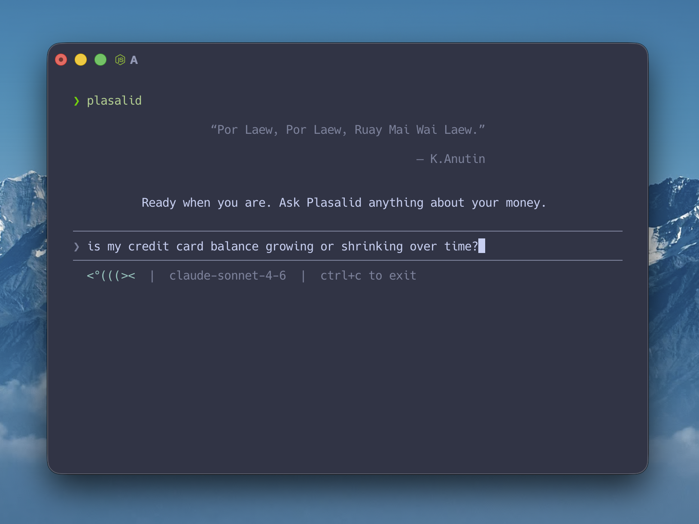

<p align="center">
  
</p>

<h1 align="center">Plasalid</h1>

<p align="center">
  <strong>The Harness Layer for Personal Finance</strong>
</p>

<p align="center">
    Turn your scattered financial documents into structured, insightful, AI-readable context.
</p>


<br />

In the US/EU, a financial data aggregator like Plaid empowers most finance apps: one connection, and every app sees the same unified view of your accounts. Most of the world doesn't have that, including Thailand, where there's no such aggregator platform. All bank data is siloed: to know where your financial status stands means logging into five bank apps one by one. Creating a unified view of personal financial data is very challenging.

That's why Plasalid emerged to resolve this pain point. Your data has stayed fragmented for decades, with no way to bring it together. You can't manage a mortgage effectively without the full picture, and you may be completely blind to your recurring monthly income and expenses. Subscriptions stay active long after they're forgotten, unknown charges go unverified, bank accounts opened years ago drift unchecked, and unexpected spending may silently grow beyond what any single statement shows. When your finances are hard to manage, your life definitely becomes more difficult. Your plans toward financial stability or freedom slip further out of reach. Plasalid is built to solve this.

Plasalid addresses this with a simple founding concept: let users drop all their financial documents - bank statements, credit-card statements, payslips, brokerage statements - onto their own machine, where Plasalid leverages AI to extract every transaction, balance, and holding into a single, structured, double-entry database that serves as context for future processing.

Moreover, Plasalid comes with a built-in agentic chat that queries the data directly, so questions like which subscriptions are still active, where money went last month, or what your current net worth is can be answered against actual records rather than estimates. You can talk with your money on Plasalid to help you understand your financial situation and plan efficiently.

The data ledger also serves as a harness, open to any AI agent that connects to it, so the picture you assemble once is reusable across whatever tools you choose to use.

<p align="center">
  
</p>

## Features

### Unified ledger from any financial documents

- **Drop PDFs, get a complete ledger.** Bank statements, credit-card statements, payslips, brokerage statements, and etc. — Plasalid uses AI to parse every transaction, balance, and holding into double-entry ledger.
- **No aggregator, no per-bank login.** The picture assembles itself from documents you already receive each month. No manual entry. No fragile connector to maintain.

### Build in AI agent that queries your real data

- **Ask in plain language.** "Which subscriptions are still active?" "Where did money go last month?" "How much did I spend at Starbucks this year?" "What's my net worth right now?"
- **Answers from actual records.** Figures, dates, and merchants are drawn straight from double-entry ledger — never an estimate, never invented.

### Local-first, private, and open as harness

- **Everything runs on your machine.** AES-256-encrypted SQLite ledger. Fully encrypted sensitive data. No cloud aggregator, no upstream account, no third-party can touch your data.
- **PII redacted on the way out.** Your names, your identity, phone numbers, and full account/card numbers are scrubbed before any prompt leaves your machine.
- **Pluggable AI provider.** Anthropic, or any OpenAI compatible local model — pick at setup; local models keep inference 100% offline.
- **A harness layer for AI agents.** Plasalid's standard double-entry ledger is the baseline data layer — open for extensibility by design.


## Install

```bash
npm install -g plasalid
```

Requires Node ≥ 18.

## Quick Start

```bash
plasalid setup
```

Then:

1. Run `plasalid open` to pop open your data folder in Finder/Explorer, then drag in any bank or credit-card statement PDF you've got. **One file is enough to start** — Plasalid will already give you useful answers about that account. More files make the picture richer.
2. Run `plasalid scan` — it parses your PDFs end-to-end without stopping.
3. Run `plasalid resolve` to connect related transactions, learn your recurring rhythms, and clear up anything the scanner flagged as a unknown.
4. Run `plasalid` to chat with what was scanned.

Other day-to-day commands:

- `plasalid scan <regex>` — only scan files whose path matches the regex.
- `plasalid scan <regex> --force` — re-scan matching files (replaces prior records).
- `plasalid resolve` — walk every open unknown one at a time and apply your decision (categorize, merge duplicates, link recurrences, skip). Filter with `--account`, `--from`, `--to`, or `--kind`.
- `plasalid revert <regex>` — delete scanned files matching the regex and every transaction derived from them.

## Commands

Run `plasalid --help` to see all available commands.

```bash
plasalid                            # Interactive chat with your data
plasalid setup                      # Configure API key, encryption, and data directory
plasalid data                       # Open the Plasalid data folder in your file explorer
plasalid accounts                   # Show the chart of accounts with balances
plasalid transactions               # List transactions and their postings (filter by --account, --from, --to, --query, --limit)
plasalid status                     # Net worth and this-month income/expense totals
plasalid record [utterance]         # Add a manual transaction, account, balance, or merchant from a plain-language line
plasalid scan [regex] [--force]     # Scan new PDFs; --force cascade-deletes prior records before re-scanning
plasalid revert [regex]             # Delete scanned files matching <regex> and their transactions
plasalid resolve                    # Walk every open unknown and apply your decision (--account, --from, --to, --kind also accepted)
```

## How It Works

```
  Bank · Card · Payslip · Brokerage · Transfer · Receipt
                  │
             (drop PDFs)
                  │
       ┌──────────▼──────────┐
       │  ~/.plasalid/data/  │
       └──────────┬──────────┘
                  │
    plasalid scan / plasalid record
                  │
       AI provider (PII-redacted)
                  │
       ┌──────────▼──────────┐
       │     Encrypted DB    │◀──── plasalid resolve
       └──────────┬──────────┘       
                  │                   
               plasalid               
```

Two outbound calls: the AI provider during scan, and the AI provider during chat. Both are PII-redacted. Your financial data is never stored off your machine. The same encrypted ledger is open to external AI agents through a local MCP / API server (coming next). No telemetry. No analytics.

## Security & Privacy

- All financial data stored locally in `~/.plasalid/db.sqlite`
- Database encrypted with AES-256 (libsql)
- Config file stored with `0600` permissions
- PII redacted before sending to any AI provider
- Encrypted-PDF passwords are AES-GCM-encrypted inside `db.sqlite` under a filename pattern; never written to disk in plaintext.
- Only outbound traffic is to your configured AI provider

## Configuration

Plasalid stores everything in `~/.plasalid/`:

```
~/.plasalid/
  config.json          # API keys and preferences (0600 permissions)
  context.md           # Persistent personal context
  db.sqlite            # Encrypted SQLite database
  data/                # Drop any PDFs here (subfolders allowed; AI classifies)
```

`db.sqlite` holds the three-layer ledger (hierarchical accounts, deduplicated merchants with learned default categories, transactions and postings), scan history, open unknowns awaiting resolve, recurring transactions (Spotify, salary, rent — recognized during resolve and linked from each member transaction), an action log for record-mode audit, persisted long-term memories, and AES-GCM-encrypted PDF passwords keyed by filename pattern. Everything is wrapped in libsql's AES-256 page encryption.

### Environment Variables

```bash
ANTHROPIC_API_KEY=            # Anthropic API key (required when provider is anthropic)
PLASALID_MODEL=               # Model name; default for Anthropic: claude-sonnet-4-6
PLASALID_PROVIDER=            # anthropic | openai-compatible. Default: anthropic
OPENAI_COMPATIBLE_BASE_URL=   # e.g. http://localhost:11434/v1 (Ollama)
OPENAI_COMPATIBLE_API_KEY=    # API key for the OpenAI-compatible server (often unused)
PLASALID_DB_ENCRYPTION_KEY=   # DB encryption passphrase
PLASALID_DB_PATH=             # Default: ~/.plasalid/db.sqlite
PLASALID_DATA_DIR=            # Default: ~/.plasalid/data
```

## Contributing

```bash
git clone https://github.com/phureewat29/plasalid
cd plasalid
npm install
npm run build
npm link # makes 'plasalid' available globally
```

## License

Plasalid is released under the [Apache License 2.0 with the Commons Clause](./LICENSE).

You're free to use, copy, modify, distribute, and fork it. The Commons Clause adds one restriction: **you may not Sell the Software** — that is, you may not provide a paid product or service whose value derives entirely or substantially from Plasalid's functionality (including paid hosting or support). For commercial-resale rights, contact the copyright holder to negotiate a separate license.
